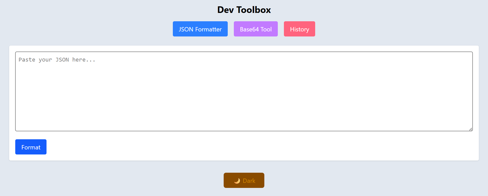
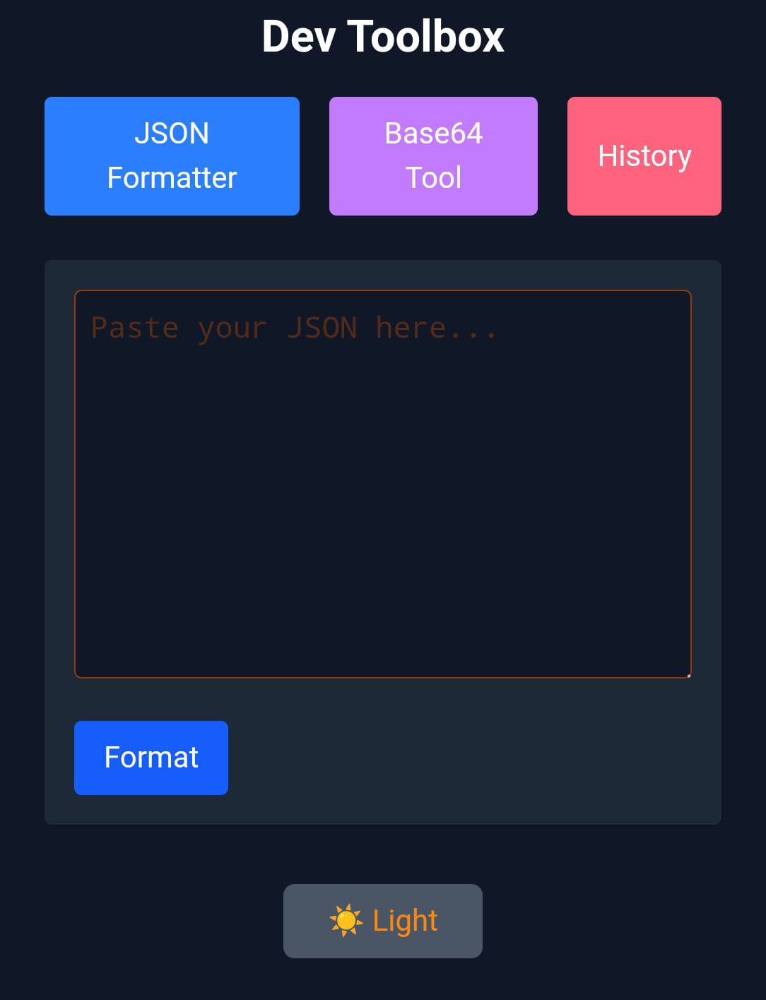

## Made By - Sayan Kundu

**B.Tech in Computer Science | Full Stack Developer | Passionate about building real-world solutions**

---

## 🔗 Links
[](https://drive.google.com/file/d/1Mhn6U396WW0DiciBdBbsP2eJP5P9CSg4/view?usp=drive_link)
[](https://www.linkedin.com/in/sayan-kundu-70b5442b6/)
[](https://github.com/sayank22)
[](https://sayan-kundu-portfolio.netlify.app)

---

# Dev Toolbox

Dev Toolbox is a lightweight and user-friendly web application designed to simplify routine development tasks. Built using React and Node.js, it offers essential utilities like JSON formatting and Base64 encoding/decoding—all in one place. Whether you're debugging APIs or working with encoded data, Dev Toolbox helps you get the job done faster.

---

# Dev Toolbox Live Link

Live Link: [https://dev-toolbox-sayankundu.vercel.app/](https://dev-toolbox-sayankundu.vercel.app/)

---

## Features

- **🔧 JSON Formatter:**  
  Input raw JSON and get prettified, indented output

  Instantly highlights errors for invalid JSON

- **🔐 Base64 Encoder/Decoder:**  
  Encode plain text to Base64

  Decode Base64 back to human-readable text

- **🧠 Process History:**  
  View all previously formatted JSON entries

- **🌙 Dark Mode Toggle:**  
  Seamlessly switch between light and dark themes for better readability

- **📋 Clipboard Copy Button:**  
  Quickly copy output data with a single click


---

## 🚀 Technologies I Used

**Frontend:**
 ⚛️ React, 📦 Vite, 📍 React Router

**Backend:**
 🛠️ Node.js, 🚀 Express

**UI/UX:** 
🎨 Tailwind CSS, 📱 Fully Responsive Design

**Database:** 
🗃️ MongoDB

**Frontend Deployment:**
 ▲ Vercel

**Backend Deployment:**
 🌐 Render

---

## 🌐 Live Links

**🔗 Frontend: https://dev-toolbox-sayankundu.vercel.app**
**🔗 Backend API: https://dev-toolbox-ibv6.onrender.com**

---


## Getting Started

# 1. Clone the repo
   ```bash
   git clone https://github.com/sayank22/Dev-Toolbox.git
   ```

# 2. Backend Setup
   ```bash
  cd server
npm install

   ```
**Create a .env file in /Server:**
```ini
PORT=5000
MONGODB_URI=your_mongodb_connection_string

```
**Run the server:**
```bash

node server.js

```

# 3. Frontend Setup
   ```bash
  cd client
npm install

   ```
**Create a .env file in /client:**
```ini
VITE_API_URL=https://your-backend-url.com

```
**Run the server:**
```bash

npm run dev

```

## 🐳 Docker 

### Prerequisites
- [Docker](https://www.docker.com/)
- [Docker Compose](https://docs.docker.com/compose/)

### Run the app

```bash
docker-compose up --build
```
Frontend: http://localhost:5173

Backend: http://localhost:5000

---

## 🚀 Future Improvements

Here are some ideas to enhance **Dev Toolbox** further:

- 🐳 **Dockerize Completely**: Already in progress — ensure seamless local setup using Docker Compose for both frontend and backend.

- 📤 **File Upload for JSON**: Allow users to upload `.json` files for formatting instead of pasting text manually.

- 📥 **Download Result**: Add a button to download prettified JSON or Base64 output as `.txt` or `.json` files.

- 🔍 **Auto Detect Mode**: Automatically detect whether input is Base64 or plain text and switch between encode/decode modes accordingly.

- 🗑️ **Delete History**: Provide a delete/reset option for the global JSON processing history.

💬 **User Authentication**: Allow login so users can view their personal formatting history.

## Demo

See it live: [https://dev-toolbox-sayankundu.vercel.app/](https://dev-toolbox-sayankundu.vercel.app/)



