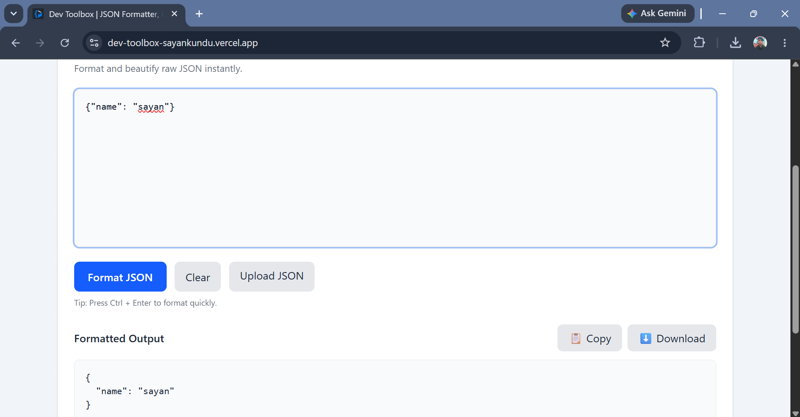
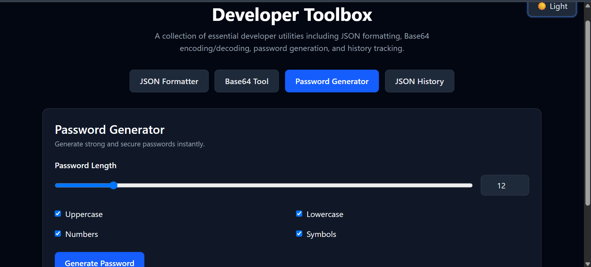

## Made By - Sayan Kundu

**Full Stack Developer | Proven Engineering Experience at Fintech and EdTech**

---

## 🔗 Links
[](https://drive.google.com/file/d/1c0JPOQJcRBYOldQvooPfd4gQQ0kkJgbq/view?usp=drive_link)
[](https://www.linkedin.com/in/sayan-kundu-70b5442b6/)
[](https://github.com/sayank22)
[](https://sayan-kundu-portfolio.netlify.app)

---

# Dev Toolbox

Dev Toolbox is a modern full-stack developer utility suite designed to simplify common development tasks. It provides a collection of essential tools including JSON formatting, Base64 encoding/decoding, secure password generation, and JSON history management through a clean, responsive, and user-friendly interface.

---

## Features

### JSON Formatter
- Format and beautify raw JSON instantly
- Upload `.json` files
- Download formatted JSON
- Copy formatted output to clipboard
- JSON statistics (lines, characters, size)
- Keyboard shortcut support (`Ctrl + Enter`)
- Persistent history stored in MongoDB

### Base64 Tool
- Encode text to Base64
- Decode Base64 back to readable text
- Copy and download results
- Reuse output as input
- Quick keyboard shortcuts

### Password Generator
- Generate secure passwords using cryptographically secure randomness
- Customize length and character types
- Password strength indicator
- Regenerate passwords instantly
- One-click copy to clipboard

### JSON History
- View previously formatted JSON entries
- Search through history
- Copy and download history entries
- Delete individual entries
- Clear all history records

### Additional Features
- Dark/Light Mode
- Responsive Design
- Toast Notifications using Sonner
- MongoDB-backed data persistence
- Modern UI built with Tailwind CSS

---

## Tech Stack

### Frontend
- React
- Vite
- Tailwind CSS
- Sonner

### Backend
- Node.js
- Express.js

### Database
- MongoDB

---

## 🌐 Live Links

**🔗 Frontend: https://dev-toolbox-sayankundu.vercel.app**
**🔗 Backend API: https://dev-toolbox-ibv6.onrender.com**

---


## Getting Started

# 1. Clone the repo
   ```bash
   git clone https://github.com/sayank22/Dev-Toolbox.git
   ```

# 2. Backend Setup
   ```bash
  cd server
npm install

   ```
**Create a .env file in /Server:**
```ini
PORT=5000
MONGODB_URI=your_mongodb_connection_string

```
**Run the server:**
```bash

node server.js

```

# 3. Frontend Setup
   ```bash
  cd client
npm install

   ```
**Create a .env file in /client:**
```ini
VITE_API_URL=https://your-backend-url.com

```
**Run the server:**
```bash

npm run dev

```

## 🐳 Docker 

### Prerequisites
- [Docker](https://www.docker.com/)
- [Docker Compose](https://docs.docker.com/compose/)

### Run the app

```bash
docker-compose up --build
```
Frontend: http://localhost:5173

Backend: http://localhost:5000

---

## Demo

See it live: [https://dev-toolbox-sayankundu.vercel.app](https://dev-toolbox-sayankundu.vercel.app)




